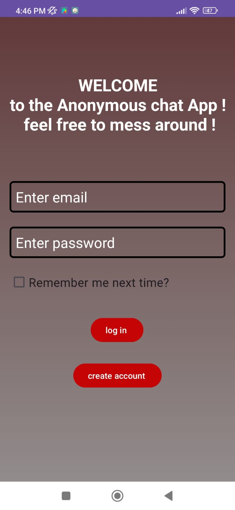
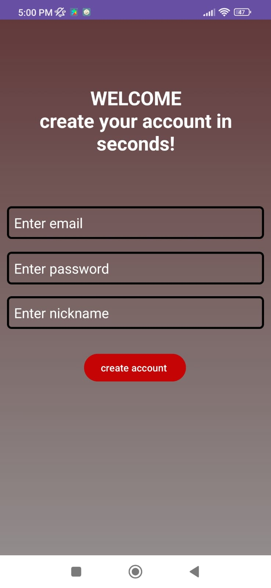
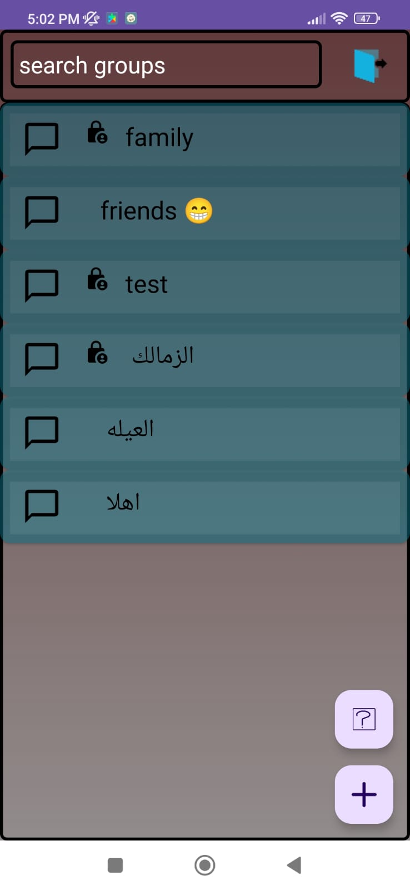
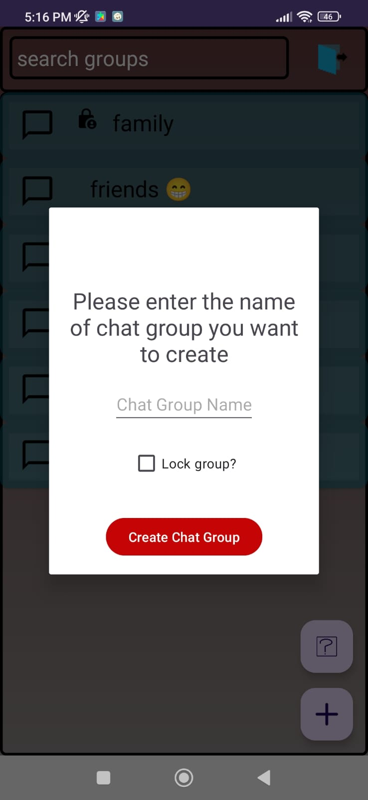
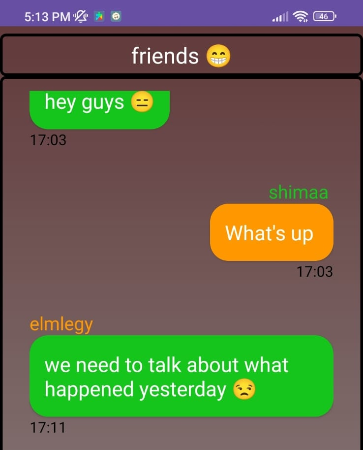

# MyAnonChat

This is an Android chat application that allows users to send and receive messages in real-time. It provides a simple and intuitive user interface for seamless communication.

## Features

- User registration and authentication
- Keep logged in feature (remember me)
- Real-time messaging with other users
- Group chat functionality
- Locked groups
- Enter a random group
- search groups by name 

## Technologies Used

- Android SDK
- java
- Firebase Realtime Database
- Firebase Authentication

## ScreenShots
- 
 
 

- 
 
 

- 
 
 

- 
 
 

- 

## License

This project is licensed under the MIT License.

## Acknowledgements

- [Firebase Documentation](https://firebase.google.com/docs)
- [Android Developers Documentation](https://developer.android.com/docs)
